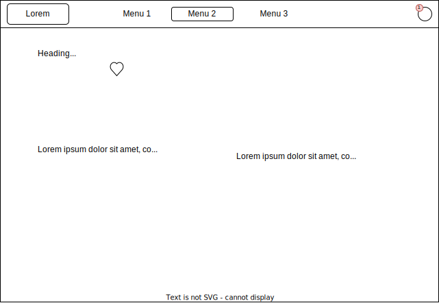

# React + Vite

This template provides a minimal setup to get React working in Vite with HMR and some ESLint rules.

Currently, two official plugins are available:

- [@vitejs/plugin-react](https://github.com/vitejs/vite-plugin-react/blob/main/packages/plugin-react/README.md) uses [Babel](https://babeljs.io/) for Fast Refresh
- [@vitejs/plugin-react-swc](https://github.com/vitejs/vite-plugin-react-swc) uses [SWC](https://swc.rs/) for Fast Refresh

### Getting started

Install dependencies:

```shell
yarn
```

Run the server:

```shell
yarn dev
```

Develop your feature. 👩‍💻👨‍💻

Test it!

```shell
yarn test
```

Commit changes:

```shell
yarn commit
```

Enjoy! 🎇

## Design

### Homepage


### Product slug



### Favorites


## Folder Structure

Designers talk about screen, developpers tend to use router. We will use a naming nomenclature as follow:

```
/src
    /contact
        /ContactPage
        /ContactsPage
    /counters
        /CountersPage
    /home
        /HomePage
            index.js            # The indexation file
            HomePage.jsx        # A component
            HomePage.test.jsx   # Test the component
            styles.css          # The CSS file for HomePage
            useNews.js          # A hook that is only used once in HomePage
            useNews.test.js     # Test the hook
    /hooks
        index.js                # Should only be used as an indexation file
        useCounter.js           # A reusable hook
```
